 
#### Music Lesson System

**Author**
Sara Schindler

**Description**
This project is a relational database for managing a music lesson school. It includes tables for students, teachers, lessons, activities, equipment, and their relationships. The database allows tracking of which students participate in which lessons and activities, as well as which equipment is used.

The project also includes SQL scripts for creating tables, inserting data, and querying the database. It is intended as an educational project to practice database design, relational modeling, and SQL operations.

## Phase 1: Design and Build the Database

## Database Diagrams

### ERD
The ERD diagram was created using ERD PLUS and shows the relationships between the tables.


### DSD
The DSD diagram was created in PGADMIN after creating the tables.


## Data Insertion
Data for all tables in the database were inserted using two methods:

### Method 1 - Python Script
All table data was inserted using a Python script. The screenshot below shows the code.


### Method 2 - Mockaroo
All table data was also inserted using Mockaroo. The screenshot below shows the process.


## SQL Files

- **[createTables.sql](part1/createTables.sql)** – Creates all the tables in the correct order.  
- **[dropTables.sql](part1/[dropTables.sql)** – Drops all the tables in the correct order.  
- **[insertTables.sql](part1/[insertTables.sql)** – Inserts the data into the tables.  
- **[selectAll.sql](part1/selectAll.sql)** – Queries for verifying and displaying the table content.

---

## Additional Files
- **lesson.csv** – CSV file containing lesson data.
- **[backUp](part1/musicLsson.backup)** - backup file for part 1.

## Phase 2: Queries

### Select Queries:


### [שאילתה 1](part2/select_query/select1/select1.sql) — פעילויות לפי חודש ושנה

השאילתה סופרת את מספר הפעילויות שבוצעו בכל חודש ובשנה בטבלת Activity. היא מפרקת את התאריך (ActivityDate) לשנה ולחודש, מסכמת את כמות הפעילויות לפי כל חודש ושנה ומסדרת את התוצאה לפי סדר כרונולוגי (שנה → חודש).

.
.


### [שאילתה 2](part2/select_query/select2/select2.sql) — ממוצע משכורות מורים לפי סוג שיעור

השאילתה מחשבת את השכר הממוצע של המורים לכל סוג שיעור בטבלת Lesson. היא מצרפת את טבלת Lesson עם טבלת Teacher לפי מזהה המורה (TId), מחשבת את השכר הממוצע לכל סוג שיעור ומסדרת את התוצאה לפי השכר הממוצע מהגבוה לנמוך.

.
.

### [שאילתה 3](part2/select_query/select3/select3.sql) — ציוד לפי כיתות

השאילתה מציגה את הציוד שהוקצה לכל כיתה בטבלת Class. היא משתמשת בטבלת הקשר IsHaving כדי לקשר בין כיתות לציוד, ומצטרפת גם לטבלת Equipment כדי להביא את סוג הציוד (Type) ואת צבעו (Color). התוצאה כוללת את שם הכיתה, סוג הציוד וצבעו, ומסודרת לפי שם הכיתה (CName).
.
.


### [שאילתה 4](part2/select_query/select3/select3.sql) - שיעורים שנפתחו השנה

השאילתה מציגה את כל השיעורים שנפתחו במהלך השנה הנוכחית מתוך טבלת Lesson. היא בודקת את שנת הפתיחה (openDate) ומשווה אותה לשנה הנוכחית, ומחזירה את שם השיעור (LName), תאריך הפתיחה, וסוג השיעור (LessonType). התוצאות מוצגות לפי תאריך הפתיחה מהחדש לישן.

.
.

### Delete Queries:


### [שאילתה 1](part2/Delete_query/delete/delete1.sql) - מחיקת כל התלמידים שלא רשומים לשום שיעור

השאילתה מעדכנת את שכרם של המורים המלמדים שיעורי פסנתר (Piano) בטבלת Teacher. היא משתמשת בטבלת Lesson כדי לזהות אילו מורים מלמדים שיעורים מסוג זה, ומעלה את שכרם ב־30% (מכפילה את הערך בעזרת Salary * 1.3).

.

טבלת התלמידים לפני מחיקה:
.
טבלת התלמידים אחרי מחיקה:
.


### Update Queries:


### [שאילתה 1](part2/Update_query/update1/update1.sql) - הגדלת משכורת המורים שמלמדים שיעורי פסנתר

השאילתה מעדכנת את שכרם של המורים המלמדים שיעורי פסנתר (Piano) בטבלת Teacher. היא משתמשת בטבלת Lesson כדי לזהות אילו מורים מלמדים שיעורים מסוג זה, ומעלה את שכרם ב־30% (מכפילה את הערך בעזרת Salary * 1.3).

.

משכורת המורים לפני ההעלאה:
.
משכורת המורים אחרי ההעלאה:
.


### [שאילתה 2](part2/Update_query/update2/update2.sql) -עדכון תאריך פתיחה לשיעורי פסנתר עם מעט תלמידים

השאילתה מעדכנת את תאריך הפתיחה (openDate) של שיעורים מסוג 'Piano' לתאריך 1 בדצמבר 2025.
העדכון מתבצע רק עבור שיעורים הנלמדים בכיתות שבהן יש פחות מ־5 תלמידים.
כדי לזהות את השיעורים הללו, השאילתה משתמשת בתת־שאילתה שמצטרפת לטבלאות Lesson, Class ו־isLearning, ומחשבת את מספר התלמידים בכל שיעור.

.

תאריכי פתיחת השיעורים לפני השינוי:
.
תאריכי פתיחת השיעורים אחרי השינוי:
.

### Constraints:
 **[Constraints.sql](part2/Constraints/Constraints.sql)**

האילוץ הראשון הוא CHECK על עמודת השכר של המורים (Teacher.Salary), שמונע הכנסת ערכים שליליים – כל ניסיון להכניס או לעדכן שכר שלילי יחזיר שגיאה, וכך נשמרת הלוגיקה העסקית של המערכת.
.

ננסה להכניס מורה עם משכורת שלילית ונקבל שגיאה:
.

האילוץ השני הוא NOT NULL על משך השיעור (Lesson.Duration), שמחייב שכל שיעור יקבל ערך עבור אורכו. הכנסת NULL או השמטת הערך תגרום לשגיאה, מה שמבטיח שניתן יהיה לנהל את השיעורים בצורה נכונה וללא חוסר נתונים.
.

ננסה להכניס שיעור שאורכו NULL ונקבל שגיאה:
.

האילוץ השלישי הוא DEFAULT על מספר התלמידים המקסימלי בכיתה (Class.MaxStudents), שמגדיר ברירת מחדל של 20 אם לא הוזן ערך; זה מאפשר הכנסת שורות חדשות בקלות ומונע NULLים מיותרים, תוך שמירה על ערך הגיוני.
.

### Rollback&Commit:
 **[rollbackCommit.sql](part2/rollbackCommit/rb.sql)**
 
 ביצוע Rollback לשאילתה אחרי עדכון:
  ****
   ביצוע Commit לשאילתה אחרי עדכון:
  ****


## Backup
- **[backup part 2](part2/musicLesson_part2.backup)** - backup file for part 2.

## Phase 3: Integration
### New Department

 -DSD:
  
 -ERD:
  

### Unified Databases
 -DSD:
  
 -ERD:
  

### Integration Decisions  
[📜 View integrate.sql](part3/Integrate.sql)

#### 1. Unifying Student and Client Entities 
כדי למנוע כפילות בין ישות ה-Student (מערכת המוזיקה) לישות ה-Client (מערכת הספורט), הוחלט לאחדן לישות אחת. מאחר שטבלת ה-Student כבר הכילה את רוב המידע, בחרנו להרחיב אותה.

**הוספת שדות:** הוספנו את העמודה `enterdate` שהייתה קיימת באגף הספורט לטבלת הסטודנטים כדי לשמור על נתוני ההצטרפות של הלקוחות:
```sql
ALTER TABLE Student ADD COLUMN enterdate DATE DEFAULT CURRENT_DATE;
```

#### 2. Integrating Feedback and Quality Control 
הטמענו את מערכת המשובים מהאגף החדש כדי לאפשר בקרה על איכות ההוראה במרכז המוזיקה.

קישור ישויות: טבלת ה-Feedback קושרה לטבלת ה-Student באמצעות מפתח זר (SId). החלטה זו מאפשרת לשייך כל משוב לתלמיד ספציפי ולוודא תקינות נתונים (Referential Integrity)::
```sql
 ALTER TABLE Feedback 
 ADD CONSTRAINT feedback_sid_fkey 
 FOREIGN KEY (SId) REFERENCES Student(SId););
```
#### 3. Enhancing Physical Resource Management (Room Integration) 
במערכת המקורית, שיעורים לא היו משויכים למיקום פיזי. אימצנו את ישות ה-Room מאגף הספורט כדי לנהל את חדרי הלימוד.

הרחבת טבלת Lesson: הוספנו עמודת roomnum לטבלת השיעורים כדי לשייך כל שיעור לחדר שבו הוא מתקיים:
```sql
 ALTER TABLE Lesson ADD COLUMN roomnum INT;
 ALTER TABLE Lesson 
 ADD CONSTRAINT lesson_roomnum_fkey 
 FOREIGN KEY (roomnum) REFERENCES Room(roomnum);
```

#### 4. Equipment Relocation Decision
בניתוח ה-ERD המשולב, הוחלט לשנות את הקשר של הציוד (Equipment). במקום שציוד יהיה משויך לקבוצת לימוד ערטילאית, הוא קושר פיזית לחדר (Room).

היגיון לוגיסטי: החלטה זו מאפשרת מעקב מדויק אחרי מלאי הציוד הקיים בכל חלל עבודה פיזי במרכז.

#### 5. Data Migration and Population 
כדי להבטיח שהמערכת המשולבת תהיה מבצעית מיד, בוצע תהליך הזנת נתונים (Data Seeding) תוך שמירה על קשרי גומלין:

יצירת ישויות אב: ראשית הוכנסו נתונים לטבלאות Student, Teacher ו-Room.

קישור ישויות בן: לאחר מכן עודכנו טבלאות ה-Lesson וה-Feedback תוך שימוש בשאילתות משנה (Subqueries) כדי להבטיח התאמה למפתחות הזרים הקיימים:
```sql
 UPDATE Lesson SET roomnum = (SELECT roomnum FROM Room LIMIT 1) 
 WHERE LId = (SELECT LId FROM Lesson LIMIT 1);
```
#### 6. Database Optimization via Views
כדי לפשט את הגישה לנתונים המאוחדים, יצרנו מבטים (Views) המבצעים JOIN בין הטבלאות החדשות לישנות:

LessonAssignments: מאחד את נתוני השיעור, המורה והחדר הפיזי.

StudentSatisfactionReport: מאחד את פרטי התלמיד עם נתוני המשוב ומבצע סיווג לוגי (CASE) של רמת שביעות הרצון.

#### 7. Handling Missing Data (NULL Management)
במהלך יצירת המבטים, נתקלנו במצב שבו לא לכל שיעור שובץ עדיין מורה או חדר. כדי להבטיח שכל השיעורים יופיעו בדוחות הניהוליים גם אם חסר בהם מידע, בחרנו להשתמש ב-LEFT JOIN.

החלטה טכנית: שימוש ב-JOIN רגיל היה "מעלים" שיעורים ללא חדר. ה-LEFT JOIN מאפשר להציג את השיעור עם ערך NULL בעמודת החדר/מורה, מה שמהווה אינדיקציה למנהל המערכת שנדרש שיבוץ:

-- מתוך המבט LessonAssignments
```sql
 SELECT L.LName, T.TName, R.roomname
 FROM Lesson L
 LEFT JOIN Teacher T ON L.TId = T.TId
 LEFT JOIN Room R ON L.roomnum = R.roomnum;
```
החלטה זו מבטיחה שלמות נתונים (Data Integrity) ברמת התצוגה, כך ששום שיעור לא "נעלם" מהמערכת בשל חוסר בנתונים לוגיסטיים.

### מבטים (Views)
[📜 לצפייה בקובץ views.sql](part3/Views.sql)

### מבט 1: `LessonAssignments` (שיבוץ שיעורים וחדרים)

##### תיאור המבט
מבט זה מספק תמונה כוללת של מערך השיעורים במרכז המוזיקה על ידי חיבור נתוני השיעורים, המורים והמיקומים הפיזיים. המבט מציג:
- שם השיעור ורמת הקושי
- שם המורה המלמד
- שם החדר וקיבולת החדר
- היום בשבוע בו מתקיים השיעור

```sql
 SELECT * FROM MusicLesson.LessonAssignments;
 ```
  

#### שאילתה 1: ניתוח תפוסת חדרים
שאילתה זו מציגה את מספר השיעורים המשובצים לכל חדר, מה שעוזר בזיהוי עומסים במרכז.
```sql
 SELECT "שם החדר", COUNT(*) AS "כמות שיעורים" 
 FROM MusicLesson.LessonAssignments 
 GROUP BY "שם החדר";
 ```
 


#### שאילתה 2: איתור שיעורים ברמה מתקדמת ומיקומם
רשימת כל השיעורים המוגדרים ברמת 'Advanced' ושמות המורים המשובצים אליהם.
```sql
 SELECT "שם השיעור", "שם המורה", "שם החדר" 
 FROM MusicLesson.LessonAssignments 
 WHERE "רמת השיעור" = 'Advanced';
 ```
 


### מבט 2: StudentSatisfactionReport (דוח שביעות רצון תלמידים))

##### תיאור המבט
מבט זה משמש כלוח בקרה לאיכות השירות, המקשר בין פרטי התלמידים למשובים שהם הזינו. המבט כולל:

-שם התלמיד
-נושא המשוב והציון שניתן (1-5)
-סטטוס שביעות רצון (מחושב לוגית: "שביעות רצון גבוהה", "סביר", או "דורש שיפור")
-תאריך המשוב

```sql
 SELECT * FROM MusicLesson.StudentSatisfactionReport;
 ```
  


#### שאילתה 1: דוח מקרים דחופים לטיפול
 מזהה את כל המשובים שבהם הסטטוס הוא "דורש שיפור" (ציון 1-2) כדי לאפשר טיפול מהיר בתלמידים לא מרוצים.
```sql
  SELECT "שם התלמיד", "נושא המשוב", "ציון"
 FROM MusicLesson.StudentSatisfactionReport
 WHERE "סטטוס שביעות רצון" = 'Needs Improvement';
 ```
 

 
#### שאילתה 2: ממוצע ציונים לפי נושא 
מחשב את הציון הממוצע עבור כל תחום (מקצועיות, תחזוקה, יחס אישי) כדי להבין איפה המרכז מצטיין ואיפה עליו להשתפר.
```sql
 SELECT "נושא המשוב", ROUND(AVG("ציון"), 2) AS "ציון ממוצע"
 FROM MusicLesson.StudentSatisfactionReport
 GROUP BY "נושא המשוב"
 ORDER BY "ציון ממוצע" DESC;
 ```
 

 
## Backup
- **[backup part 3](part3/backup_3.backup)** - backup file for part 3.


## Phase 4: Programming (PL/pgSQL)

<div dir="rtl">


בשלב זה הוטמעה לוגיקה עסקית מתקדמת בבסיס הנתונים באמצעות פונקציות, פרוצדורות וטריגרים ב-PL/pgSQL. המטרה היא להפוך את המערכת לאוטומטית, מאובטחת וחסינה לשגיאות.

📜 [לצפייה בקובצי התכנות](part4)

#### 1. פונקציית חישוב הנחה (fn_CheckDiscount)

פונקציה זו מחשבת את אחוז ההנחה המגיע לתלמיד על סמך רמת הפעילות שלו בבית הספר:
##### אלמנטים תכנותיים:
<ul dir="rtl" style="text-align: right; list-style-position: inside;">
    <li>ספירת כמות הקורסים הפעילים של התלמיד בטבלת islearning.</li>
    <li>שימוש ב-Implicit Cursor (דרך פקודת SELECT INTO) לשליפת הנתונים.</li>
    <li><b>קביעת מדרגות הנחה דינמיות:</b></li>
    <li>• 3 קורסים ומעלה: 20% הנחה.</li>
    <li>• 1-2 קורסים: 10% הנחה.</li>
    <li>• ללא קורסים: 0% הנחה.</li>
</ul>.

  ##### 🧾 קוד

-  ```sql
   CREATE OR REPLACE FUNCTION musiclesson.fn_CheckDiscount(p_sid INT)
   RETURNS NUMERIC AS $$
   DECLARE
       v_count INT;
   BEGIN
       -- Implicit Cursor: ספירת קורסי התלמיד
       SELECT COUNT(*) INTO v_count FROM musiclesson.islearning WHERE sid = p_sid;
       
       -- לוגיקת הנחות
       IF v_count >= 3 THEN RETURN 0.20; 
       ELSIF v_count >= 1 THEN RETURN 0.10; 
       ELSE RETURN 0;
       END IF;
   END;
   $$ LANGUAGE plpgsql;
 


#### 2. פרוצדורת רישום מאובטח (pr_SafeRegister)

פרוצדורה זו מבצעת רישום מאובטח של תלמיד לשיעור תוך שימוש בלוגיקה עסקית מתקדמת, ומבטיחה שקיפות מלאה למשתמש ושמירה על שלמות הנתונים:
<ul dir="rtl" style="text-align: right; list-style-position: inside;">
    <li><b>ניהול ידני (Explicit Cursor):</b> שימוש ב-OPEN, FETCH ו-CLOSE לשליטה מלאה בזיכרון.</li>
    <li><b>מבנה לולאה (Loop):</b> סריקה מפורשת של כל רשומות התלמיד לאיתור כפילויות לוגיות.</li>
    <li><b>לוגיקה השוואתית:</b> זיהוי התאמות בין סוגי שיעורים (כמו Guitar) ומניעת כפל קורסים באותו תחום.</li>
    <li><b>טיפול בחריגות (Exception Handling):</b> תפיסת שגיאות duplicate key ומניעת קריסת המערכת.</li>
</ul>.

##### 🧾 קוד
-  ```sql
   CREATE OR REPLACE PROCEDURE musiclesson.pr_SafeRegister(p_sid INT, p_lid INT)
   AS $$
   DECLARE
       -- Explicit Cursor: הגדרת קורסור מפורש - מענה ישיר לדרישת המרצה
       cursor_student_courses CURSOR FOR 
           SELECT l.LName, l.LessonType 
           FROM musiclesson.islearning il
           JOIN musiclesson.lesson l ON il.lid = l.lid
           WHERE il.sid = p_sid;
           
       v_course_name TEXT;
       v_course_type TEXT;
       v_new_course_type TEXT;
       v_found_duplicate BOOLEAN := FALSE;
   BEGIN
       -- שליפת סוג הקורס החדש לצורך השוואה
       SELECT LessonType INTO v_new_course_type FROM musiclesson.lesson WHERE lid = p_lid;
   
       RAISE NOTICE 'מתחיל סריקה מפורשת של קורסי התלמיד (SID: %)...', p_sid;
   
       -- פתיחת הקורסור ומעבר בלולאה (Loop & Fetch)
       OPEN cursor_student_courses;
       LOOP
           FETCH cursor_student_courses INTO v_course_name, v_course_type;
           EXIT WHEN NOT FOUND; -- תנאי יציאה מהלולאה
   
           IF v_course_type = v_new_course_type THEN
               RAISE NOTICE 'התראה מהלולאה: התלמיד כבר לומד קורס מסוג % (שם: %)', v_course_type, v_course_name;
               v_found_duplicate := TRUE;
           END IF;
       END LOOP;
       CLOSE cursor_student_courses;
   
       -- ביצוע הרישום
       INSERT INTO musiclesson.islearning (sid, lid) VALUES (p_sid, p_lid);
       RAISE NOTICE 'הרישום לשיעור % הושלם בהצלחה.', p_lid;
   
   EXCEPTION
       WHEN unique_violation THEN
           RAISE EXCEPTION 'שגיאה: התלמיד כבר רשום ספציפית לשיעור זה!';
       WHEN OTHERS THEN
           RAISE NOTICE 'שגיאה ברישום (נתפס ב-Exception): %', SQLERRM;
   END;
   $$ LANGUAGE plpgsql;
 
#### 3. טריגר הגבלת תפוסה בחדר (trg_RoomLimit)

הטריגר אוכף מגבלת קיבולת פיזית בחדרי הלימוד. לפני הוספת תלמיד לשיעור, פונקציית הטריגר בודקת האם מספר הרשומים הנוכחי הגיע למקסימום המותר בחדר (20 תלמידים כברירת מחדל). במידה והחדר מלא, הטריגר זורק שגיאה (RAISE EXCEPTION) וחוסם את הטרנזקציה.

##### 🧾 קוד
-  ```sql
   CREATE OR REPLACE FUNCTION musiclesson.fn_LimitStudents()
   RETURNS TRIGGER AS $$
   DECLARE
       v_max INT := 20; 
       v_current INT;
   BEGIN
       SELECT COUNT(*) INTO v_current FROM musiclesson.islearning WHERE lid = NEW.lid;
   
       IF v_current >= v_max THEN
           RAISE EXCEPTION 'החדר מלא! תפוסה מקסימלית: %', v_max;
       END IF;
       RETURN NEW;
   END;
   $$ LANGUAGE plpgsql;
 


##### הגדרת הטריגר:
-  ```sql
   CREATE TRIGGER trg_RoomLimit
   BEFORE INSERT ON musiclesson.islearning
   FOR EACH ROW EXECUTE FUNCTION musiclesson.fn_LimitStudents();
 

#### 4. תכנית ראשית

##### תוכנית בדיקה משולבת: רישום והנחות

התוכנית מדגימה את השילוב בין כל רכיבי הקוד:

שליפת נתונים דינמית של תלמיד ושיעור קיימים.

קריאה לפונקציית ההנחה לחישוב זכאות התלמיד.

הפעלת הפרוצדורה לרישום, שמפעילה את ה-Cursor המפורש ואת בדיקת הטריגר מאחורי הקלעים.

#### הוכחות הרצה:

##### 1. הוכחת לוגיקה ו-Cursor מפורש

צילום זה מציג את פלט הפרוצדורה המשודרגת. ניתן לראות כי ה-Explicit Cursor פותח סריקה מפורשת של היסטוריית התלמיד, מזהה באמצעות לולאה קורס קיים (שיעור כינור - Lesson237), ומאשר את הרישום החדש לשיעור 100 רק לאחר השלמת הבדיקה הלוגית

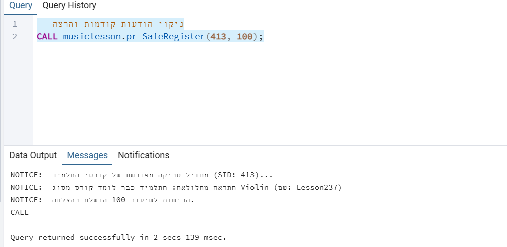

##### 2. הוכחת טיפול בחריגות (Exception Handling)

כאן מוצגת יכולת המערכת להתמודד עם שגיאות לוגיות וטכניות. בעת ניסיון רישום כפול לאותו שיעור (שיעור 8), ניתן לראות כי הפרוצדורה קודם כל מפעילה את ה-Explicit Cursor, סורקת בלולאה את הקורסים הקיימים של התלמיד ומזהה התנגשות בסוג הכלי (Guitar). לאחר מכן, בלוק ה-EXCEPTION תופס את שגיאת ה-Unique Key ומציג הודעת שגיאה מותאמת אישית ('התלמיד כבר רשום ספציפית...') במקום לקרוס

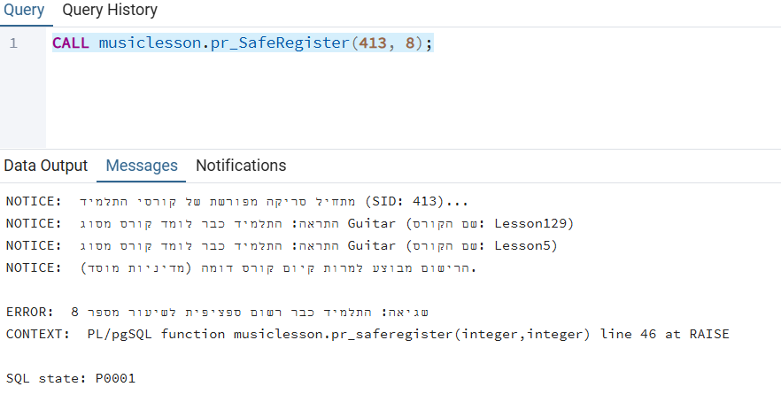

##### 3. הוכחת עדכון מסד הנתונים

אימות סופי המראה כי פעולת הרישום בוצעה בהצלחה והנתונים (תלמיד 413 בשיעור 8) נשמרו פיזית בטבלת הרישום.


**[backup part 4](part4/backup_4.backup)** - backup file for part 4.

## Phase 5: Desktop Application (GUI)

### סקירת האפליקציה

מערכת ניהול בית הספר למוזיקה היא אפליקציה שולחנית מקיפה שנבנתה באמצעות ספריית Tkinter של Python. האפליקציה מספקת ממשק משתמש גרפי ידידותי לניהול כל היבטי בסיס הנתונים, כולל ניהול תלמידים, שיעורים, רישום מאובטח והפקת דוחות אנליטיים.

### דרישות מערכת:
- **Operating System:** Windows 10/11, macOS, or Linux.

- **Python Version:** Python 3.x.

- **Required Libraries:**

-   tkinter (Standard GUI library).

-   psycopg2 (PostgreSQL adapter for Python).

### הוראות התקנה והרצה

 **התקנת ספריות נדרשות:**
   
```bash
   pip install psycopg2-binary
   ```

 **הגדרת בסיס הנתונים:**

   <ul>
  <li><strong>וידוא פעילות השרת:</strong> יש לוודא ששרת ה-PostgreSQL פועל ומאזין בפורט <code>5433</code>.</li>
  <li><strong>חיבור אוטומטי:</strong> המערכת מוגדרת להתחבר באופן אוטומטי לבסיס הנתונים בשם <code>MusicLesson</code>.</li>
  <li><strong>ניהול הגדרות:</strong> כל פרמטרי החיבור (Host, Port, DB Name) מנוהלים וניתנים לעדכון בקובץ <code>database.py</code>[cite: 6].</li>
</ul>.

**הרצת האפליקציה:** יש להריץ את הקובץ הראשי:
   

```bash
python main_app.py
   ```

### הוראות חיבור והפעלה
**הגדרת חיבור לבסיס הנתונים:**
<ol>
  <li><strong>בדיקת זמינות השרת:</strong> לפני הרצת האפליקציה, יש לוודא ששרת בסיס הנתונים (PostgreSQL) פעיל ורץ[cite: 3].</li>
  <li><strong>פרמטרי החיבור:</strong> פרמטרים אלו מוגדרים ומנוהלים בקובץ <code>database.py</code>[cite: 6]. להלן פרטי ברירת המחדל המוגדרים במערכת[cite: 4]:
    <ul>
      <li><strong>כתובת מארח (Host):</strong> 127.0.0.1 [cite: 4]</li>
      <li><strong>פורט (Port):</strong> 5433 [cite: 4]</li>
      <li><strong>שם בסיס הנתונים:</strong> MusicLesson [cite: 4]</li>
      <li><strong>שם משתמש:</strong> postgres [cite: 4]</li>
      <li><strong>סיסמה:</strong> Mss054333@ [cite: 4]</li>
    </ul>
  </li>
</ol>

### צילומי מסך של ממשק המשתמש

<ul>
  <li><strong>תפריט ראשי:</strong> מציע 5 אפשרויות ניווט לניהול תלמידים, שיעורים, רישום מאובטח ודוחות[cite: 7].
    <br>
    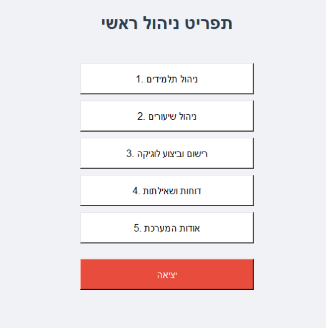
  </li>
  
  <li><strong>מסך ניהול תלמידים:</strong> במסך זה ניתן לבצע שליפה, הוספה, עדכון ומחיקה של תלמידים[cite: 8].
    <br>
    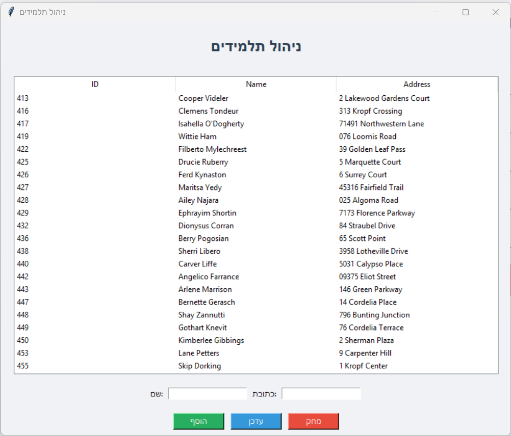
  </li>

  <li><strong>מסך ניהול שיעורים:</strong> מאפשר ניהול CRUD מלא של קטלוג השיעורים ועדכון מחירים[cite: 8].
    <br>
    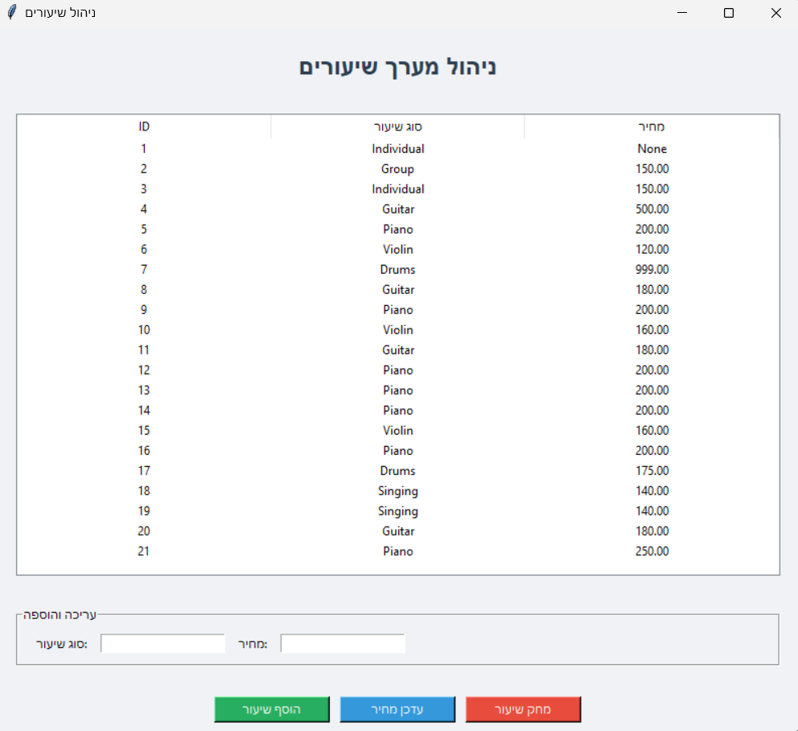
  </li>

  <li><strong>מסך ניהול הרשמה:</strong> הזנת SID ו-LID להפעלת הפרוצדורה המאובטחת והצגת הודעות חיווי מהשרת[cite: 9, 10].
    <br>
    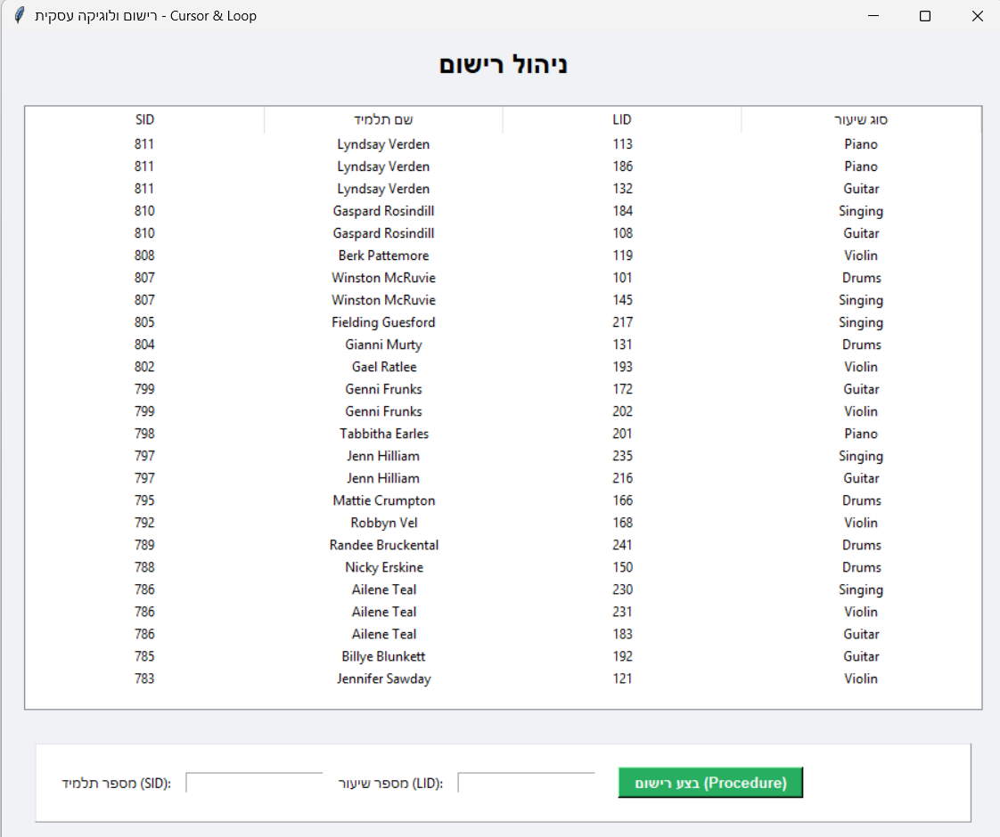
  </li>

  <li><strong>מסך דוחות ושאילתות:</strong> מציג את השאילתות משלב ב' בפורמט טבלאי נוח.
    <br>
    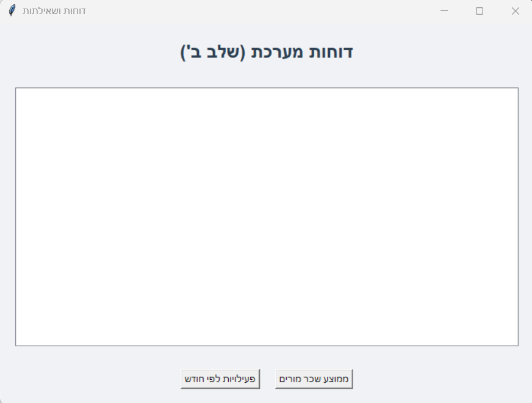
  </li>

  <li><strong>אודות המערכת:</strong> מסך המציג את פרטי הגרסה והמפתח.
    <br>
    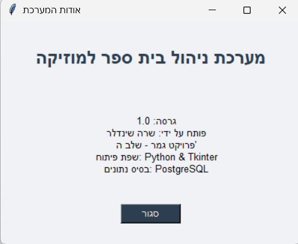
  </li>
</ul>


### מבנה האפליקציה (ארכיטקטורה)
 האפליקציה בנויה במבנה מודולרי להפרדה בין העיצוב, החיבור למסד הנתונים והמסכים השונים:

```
 part5/
 │
 ├── main_app.py           # Main entry point & Navigation Menu
 ├── database.py           # Database connection & Configuration
 ├── styles.py             # Global UI styling and themes
 └── screens/              # Individual functional modules
     ├── students.py       # Student CRUD interface
     ├── lessons.py        # Lesson management
     ├── registration.py   # Procedures & Functions execution
     ├── reports.py        # Query reports interface
     └── about.py          # System information screen
```

## 📂 Python Files
#### Core Application Files

- **[main_app.py](part5/main_app.py)** – נקודת הכניסה הראשית לאפליקציה ומערכת התפריטים המרכזית.


- **[database.py](part5/database.py)** – ניהול החיבור לבסיס הנתונים PostgreSQL והגדרות התצורה.

- **[styles.py](part5/styles.py)** – הגדרות עיצוב גלובליות, צבעים וגופנים לממשק המשתמש.

## 📂 Screen Modules

- **[students.py](part5/screens/students.py)** – ממשק ניהול תלמידים (Student Management): ביצוע פעולות CRUD מלאות עבור תלמידים בבית הספר למוזיקה.

- **[lessons.py](part5/screens/lessons.py)** – ממשק ניהול שיעורים (Lesson Management): צפייה במאגר השיעורים ועדכון מחירים.

- **[registration.py](part5/screens/registration.py)** – ממשק רישום ולוגיקה (Registration & Logic): ביצוע רישום תלמידים לשיעורים באמצעות פרוצדורות (Procedures) ותפיסת הודעות מהשרת.

- **[reports.py](part5/screens/reports.py)** – ממשק שאילתות ודוחות (Query Reports): הפקת דוחות ניהוליים המבוססים על שאילתות מורכבות של המערכת.

- **[about.py](part5/screens/about.py)** – ממשק אודות המערכת (About Interface): הצגת פרטי גרסה, מפתח וטכנולוגיות פיתוח.  

## 🛠️ Operating Instructions

#### Starting the Application

- **Launch:** הרץ את הפקודה python main_app.py מתוך הטרמינל או שורת הפקודה בתיקיית הפרויקט.

- **Main Menu:** האפליקציה תיפתח בחלון מרכזי המציג את תפריט הניהול הראשי, הכולל 5 אפשרויות ניווט.

- **Navigation:** לחץ על כל אחד מהכפתורים הצבעוניים כדי לגשת למודולים השונים של המערכת.

#### Using Each Module
**👥 ניהול תלמידים (Student Management):**
<ul>
  <li>גישה למאגר התלמידים המלא ותצוגתו בטבלה אינטראקטיבית[cite: 8].</li>
  <li>הוספת תלמידים חדשים למערכת על ידי הזנת שם וכתובת[cite: 8].
    <br>
    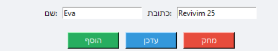
  </li>
  <li>עדכון פרטי תלמידים קיימים ומחיקת רשומות מהמסד לאחר בחירת שורה בטבלה[cite: 8].
    <br>
    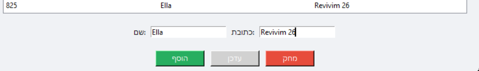
  </li>
</ul>

#### 🔐 רישום ולוגיקה (Secure Registration)
<ul>
  <li>ביצוע רישום תלמיד (SID) לשיעור (LID) תוך הפעלת הפרוצדורה המאובטחת <code>pr_SafeRegister</code>.
    <br>
    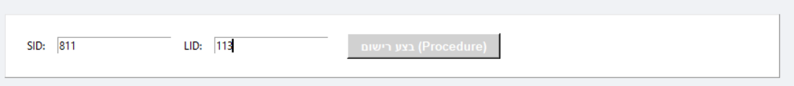
  </li>
  <li>המערכת משתמשת ב-Explicit Cursor וב-Loop בתוך ה-SQL כדי לסרוק את היסטוריית התלמיד ולמנוע כפל קורסים[cite: 10].</li>
  <li>קבלת הודעות חיווי (Notices) ושגיאות טריגרים (כמו חדר מלא) ישירות בחלונות קופצים (Message Boxes)[cite: 10].
    <br>
    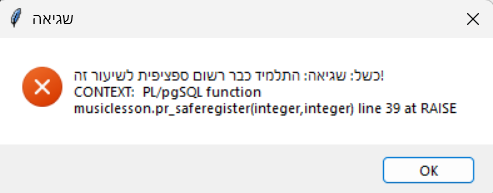
  </li>
</ul>

#### 📊 דוחות ושאילתות (Reports & Analytics)
<ul>
  <li>הפקת דוחות ניהוליים המבוססים על השאילתות שנוצרו בשלבי התכנון המוקדמים[cite: 7, 9].</li>
  <li>צפייה בנתוני פעילות לפי חודשים וניתוח שכר מורים ממוצע לפי סוג שיעור.
    <br>
    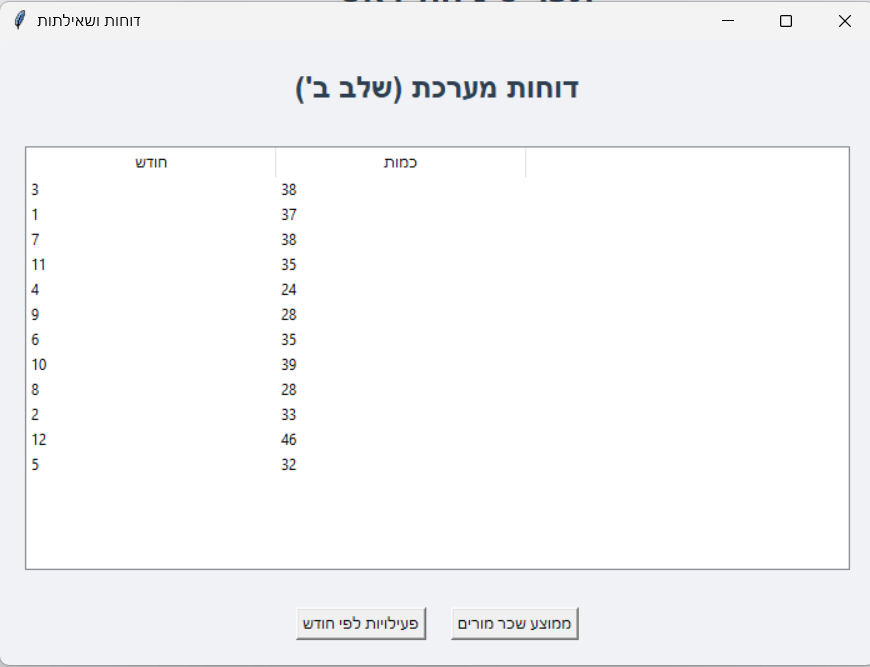
    <br>
    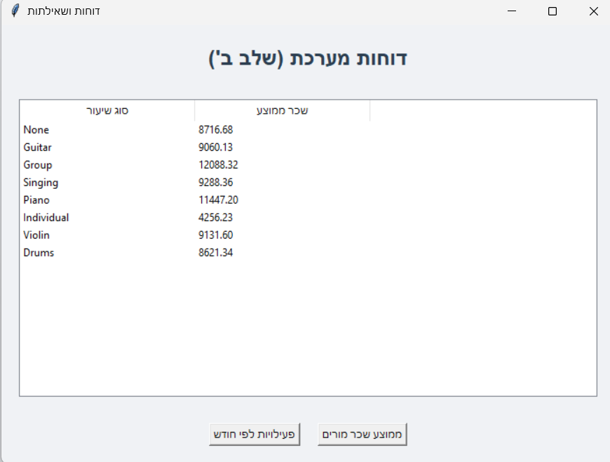
  </li>
</ul>

## 🔄 Navigation Flow

**Module Selection:** בחר את הפונקציה הרצויה מתפריט הניהול הראשי (ניהול תלמידים, שיעורים, רישום או דוחות).

**Module Operation:** בצע את המשימות הנדרשות בתוך המודול שנבחר, כגון הוספת תלמיד, עדכון מחיר שיעור או הרצת שאילתה אנליטית.

**Return to Menu:** השתמש בכפתור הסגירה של החלון (X) או בכפתור "סגור" כדי לחזור לממשק התפריט הראשי.

**Exit Application:** השתמש בכפתור ה"יציאה" האדום בתפריט הראשי כדי לסגור את האפליקציה בבטחה ולנתק את החיבור למסד הנתונים.

### ⚙️ הסבר על שיטת העבודה

#### תהליך הפיתוח
<ul>
  <li><strong>1. אינטגרציה עם בסיס הנתונים:</strong> חיבור האפליקציה השולחנית לבסיס הנתונים הקיים מהשלבים הקודמים באמצעות ספריית <code>psycopg2</code>[cite: 2, 6].</li>
  <li><strong>2. עיצוב מודולרי:</strong> פיצול הקוד למודולים נפרדים (תיקיית <code>screens</code>) כדי להבטיח קוד נקי, הפרדת סמכויות ותחזוקתיות קלה של המערכת[cite: 6].</li>
  <li><strong>3. עיצוב ממשק משתמש:</strong> יישום ממשק מקצועי ונקי תוך שימוש ב-Styles אחידים וערכות צבעים המעידות על סוג הפעולה (ירוק להצלחה, אדום למחיקה)[cite: 6].</li>
  <li><strong>4. טיפול בשגיאות:</strong> הטמעת מנגנוני <code>try-except</code> ותפיסת הודעות <code>RAISE NOTICE</code> מהפרוצדורות ב-SQL כדי לספק משוב מפורט ובזמן אמת למשתמש[cite: 10].</li>
</ul>

#### תכונות מרכזיות שהוטמעו
<ul>
  <li><strong>פעולות CRUD מלאות:</strong> אפשרות לביצוע שליפה, הוספה, עדכון ומחיקה עבור לפחות 3 ישויות מרכזיות בבסיס הנתונים[cite: 8].</li>
  <li><strong>תצוגת נתונים בזמן אמת:</strong> חיבור חי וישיר למסד הנתונים המבטיח עדכון מיידי של הטבלאות הגרפיות לאחר כל שינוי[cite: 8].</li>
  <li><strong>מניעת טעויות:</strong> אימות קלט והצגת הודעות שגיאה ידידותיות במקרה של הפרת אילוצים עסקיים (כמו ניסיון רישום לחדר מלא או כפל קורסים)[cite: 10].</li>
</ul> 

</div>
