#### Music Lesson System

**Author**
Sara Schindler

**Description**
This project is a relational database for managing a music lesson school. It includes tables for students, teachers, lessons, activities, equipment, and their relationships. The database allows tracking of which students participate in which lessons and activities, as well as which equipment is used.

The project also includes SQL scripts for creating tables, inserting data, and querying the database. It is intended as an educational project to practice database design, relational modeling, and SQL operations.

## Phase 1: Design and Build the Database

## Database Diagrams

### ERD
The ERD diagram was created using ERD PLUS and shows the relationships between the tables.
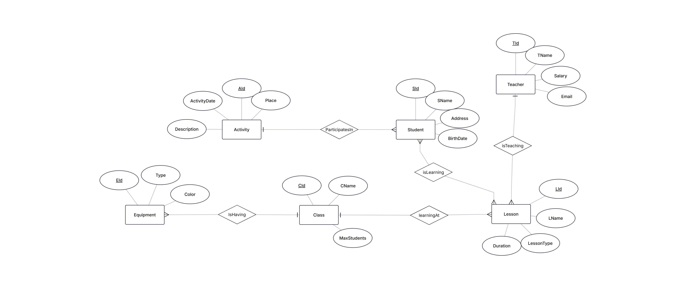

### DSD
The DSD diagram was created in PGADMIN after creating the tables.
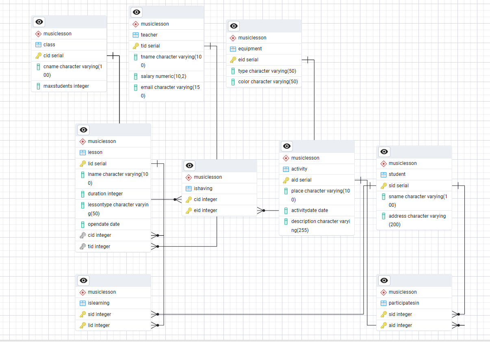

## Data Insertion
Data for all tables in the database were inserted using two methods:

### Method 1 - Python Script
All table data was inserted using a Python script. The screenshot below shows the code.


### Method 2 - Mockaroo
All table data was also inserted using Mockaroo. The screenshot below shows the process.
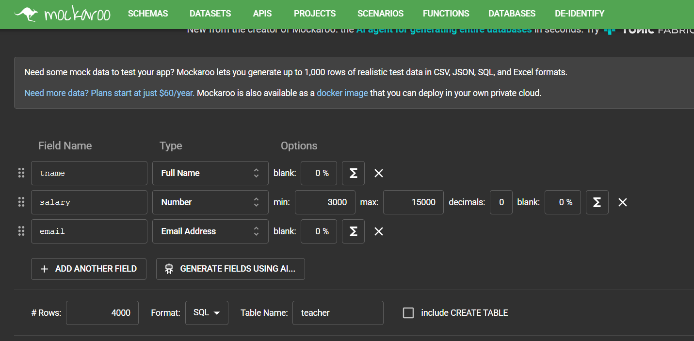


## SQL Files

- **[createTables.sql](part1/createTables.sql)** – Creates all the tables in the correct order.  
- **[dropTables.sql](part1/[dropTables.sql)** – Drops all the tables in the correct order.  
- **[insertTables.sql](part1/[insertTables.sql)** – Inserts the data into the tables.  
- **[selectAll.sql](part1/selectAll.sql)** – Queries for verifying and displaying the table content.

---

## Additional Files
- **lesson.csv** – CSV file containing lesson data.
- **[backUp](part1/musicLsson.backup)** - backup file for part 1.

## Phase 2: Queries

### Select Queries:


### [שאילתה 1](part2/select_query/select1/select1.sql) — פעילויות לפי חודש ושנה

השאילתה סופרת את מספר הפעילויות שבוצעו בכל חודש ובשנה בטבלת Activity. היא מפרקת את התאריך (ActivityDate) לשנה ולחודש, מסכמת את כמות הפעילויות לפי כל חודש ושנה ומסדרת את התוצאה לפי סדר כרונולוגי (שנה → חודש).

.
.


### [שאילתה 2](part2/select_query/select2/select2.sql) — ממוצע משכורות מורים לפי סוג שיעור

השאילתה מחשבת את השכר הממוצע של המורים לכל סוג שיעור בטבלת Lesson. היא מצרפת את טבלת Lesson עם טבלת Teacher לפי מזהה המורה (TId), מחשבת את השכר הממוצע לכל סוג שיעור ומסדרת את התוצאה לפי השכר הממוצע מהגבוה לנמוך.

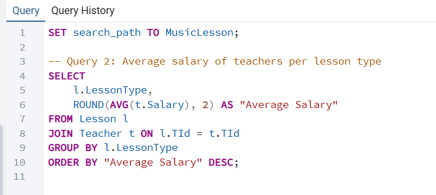.
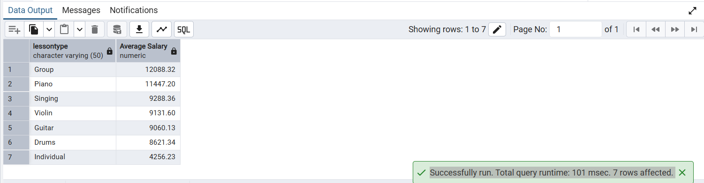.

### [שאילתה 3](part2/select_query/select3/select3.sql) — ציוד לפי כיתות

השאילתה מציגה את הציוד שהוקצה לכל כיתה בטבלת Class. היא משתמשת בטבלת הקשר IsHaving כדי לקשר בין כיתות לציוד, ומצטרפת גם לטבלת Equipment כדי להביא את סוג הציוד (Type) ואת צבעו (Color). התוצאה כוללת את שם הכיתה, סוג הציוד וצבעו, ומסודרת לפי שם הכיתה (CName).
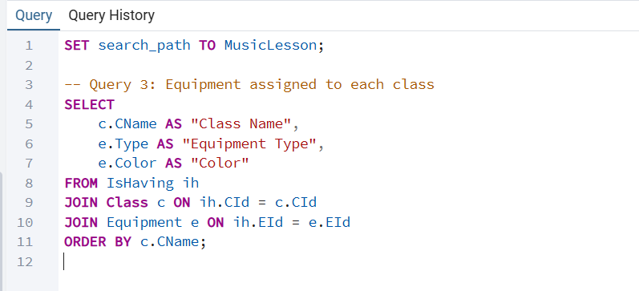.
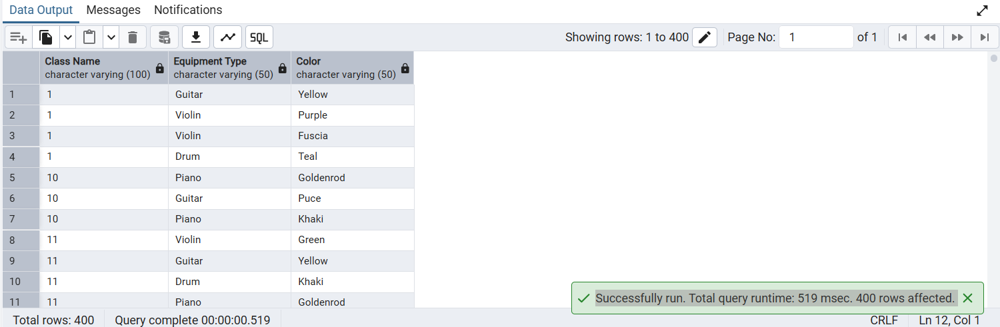.


### [שאילתה 4](part2/select_query/select3/select3.sql) - שיעורים שנפתחו השנה

השאילתה מציגה את כל השיעורים שנפתחו במהלך השנה הנוכחית מתוך טבלת Lesson. היא בודקת את שנת הפתיחה (openDate) ומשווה אותה לשנה הנוכחית, ומחזירה את שם השיעור (LName), תאריך הפתיחה, וסוג השיעור (LessonType). התוצאות מוצגות לפי תאריך הפתיחה מהחדש לישן.

.
.

### Delete Queries:


### [שאילתה 1](part2/Delete_query/delete/delete1.sql) - מחיקת כל התלמידים שלא רשומים לשום שיעור

השאילתה מעדכנת את שכרם של המורים המלמדים שיעורי פסנתר (Piano) בטבלת Teacher. היא משתמשת בטבלת Lesson כדי לזהות אילו מורים מלמדים שיעורים מסוג זה, ומעלה את שכרם ב־30% (מכפילה את הערך בעזרת Salary * 1.3).

.

טבלת התלמידים לפני מחיקה:
.
טבלת התלמידים אחרי מחיקה:
.


### Update Queries:


### [שאילתה 1](part2/Update_query/update1/update1.sql) - הגדלת משכורת המורים שמלמדים שיעורי פסנתר

השאילתה מעדכנת את שכרם של המורים המלמדים שיעורי פסנתר (Piano) בטבלת Teacher. היא משתמשת בטבלת Lesson כדי לזהות אילו מורים מלמדים שיעורים מסוג זה, ומעלה את שכרם ב־30% (מכפילה את הערך בעזרת Salary * 1.3).

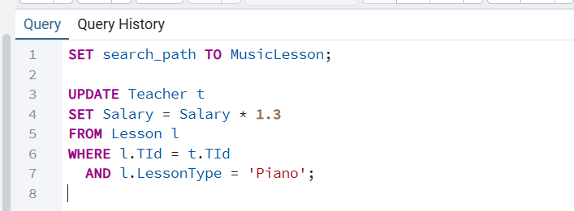.

משכורת המורים לפני ההעלאה:
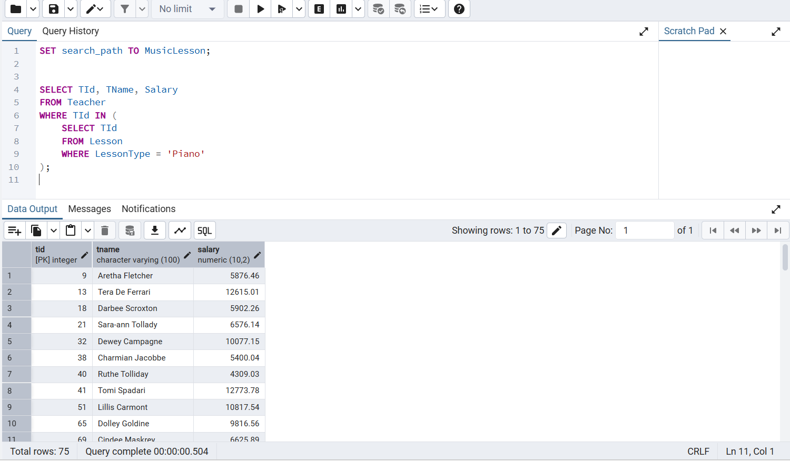.
משכורת המורים אחרי ההעלאה:
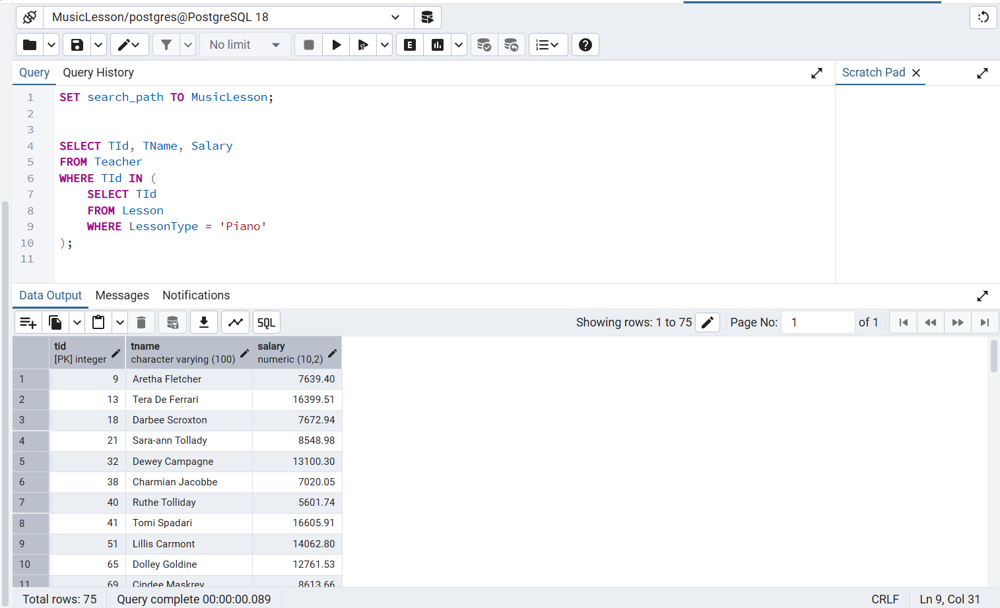.


### [שאילתה 2](part2/Update_query/update2/update2.sql) -עדכון תאריך פתיחה לשיעורי פסנתר עם מעט תלמידים

השאילתה מעדכנת את תאריך הפתיחה (openDate) של שיעורים מסוג 'Piano' לתאריך 1 בדצמבר 2025.
העדכון מתבצע רק עבור שיעורים הנלמדים בכיתות שבהן יש פחות מ־5 תלמידים.
כדי לזהות את השיעורים הללו, השאילתה משתמשת בתת־שאילתה שמצטרפת לטבלאות Lesson, Class ו־isLearning, ומחשבת את מספר התלמידים בכל שיעור.

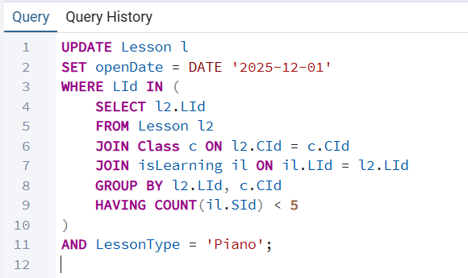.

תאריכי פתיחת השיעורים לפני השינוי:
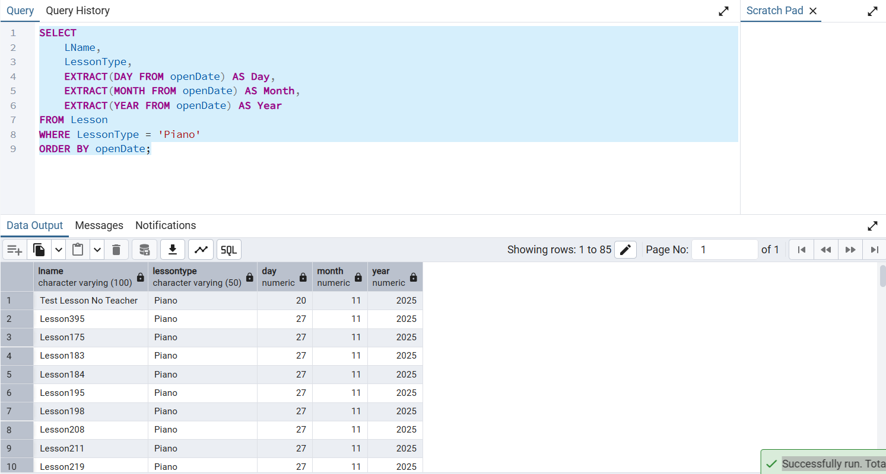.
תאריכי פתיחת השיעורים אחרי השינוי:
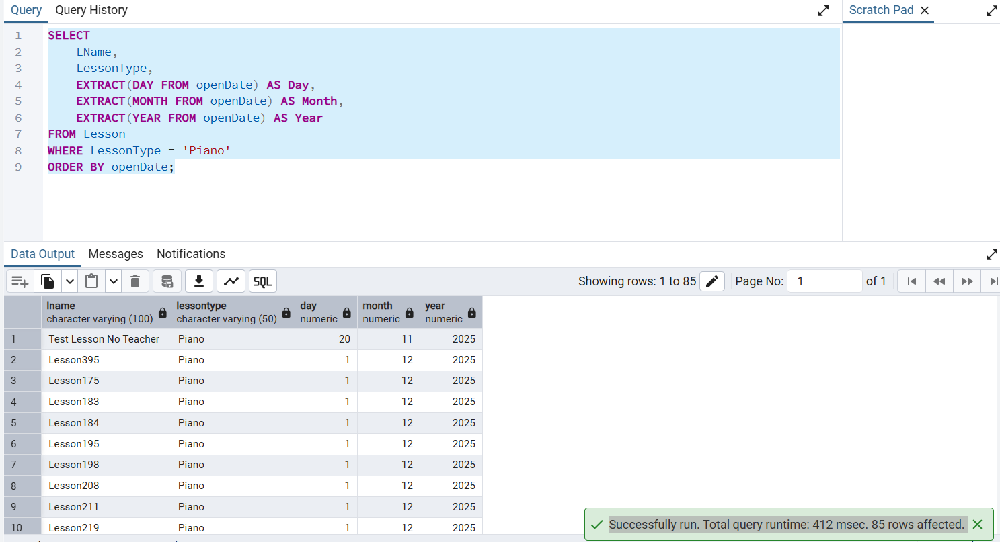.

### Constraints:
 **[Constraints.sql](part2/Constraints/Constraints.sql)**

האילוץ הראשון הוא CHECK על עמודת השכר של המורים (Teacher.Salary), שמונע הכנסת ערכים שליליים – כל ניסיון להכניס או לעדכן שכר שלילי יחזיר שגיאה, וכך נשמרת הלוגיקה העסקית של המערכת.
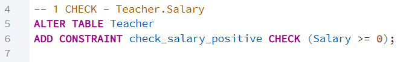.

ננסה להכניס מורה עם משכורת שלילית ונקבל שגיאה:
.

האילוץ השני הוא NOT NULL על משך השיעור (Lesson.Duration), שמחייב שכל שיעור יקבל ערך עבור אורכו. הכנסת NULL או השמטת הערך תגרום לשגיאה, מה שמבטיח שניתן יהיה לנהל את השיעורים בצורה נכונה וללא חוסר נתונים.
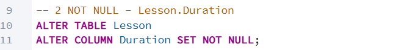.

ננסה להכניס שיעור שאורכו NULL ונקבל שגיאה:
.

האילוץ השלישי הוא DEFAULT על מספר התלמידים המקסימלי בכיתה (Class.MaxStudents), שמגדיר ברירת מחדל של 20 אם לא הוזן ערך; זה מאפשר הכנסת שורות חדשות בקלות ומונע NULLים מיותרים, תוך שמירה על ערך הגיוני.
.

### Rollback&Commit:
 **[rollbackCommit.sql](part2/rollbackCommit/rb.sql)**
 
 ביצוע Rollback לשאילתה אחרי עדכון:
  **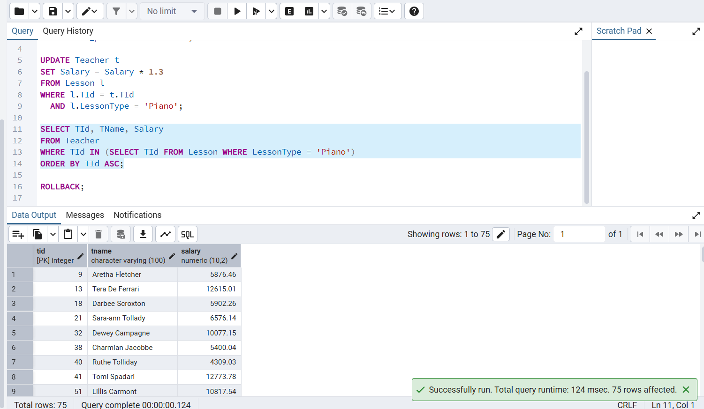**
   ביצוע Commit לשאילתה אחרי עדכון:
  **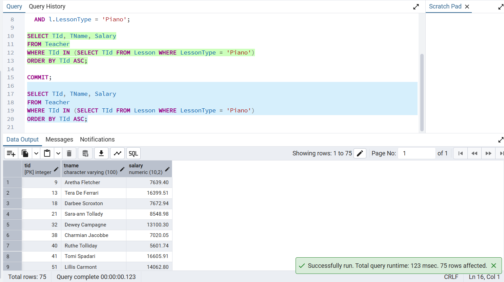**


## Backup
- **[backup part 2](part2/musicLesson_part2.backup)** - backup file for part 2.

## Phase 3: Integration
### New Department

 -DSD:
  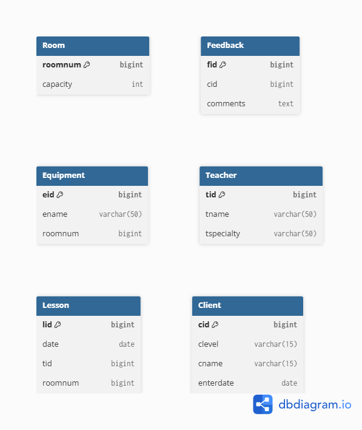
 -ERD:
  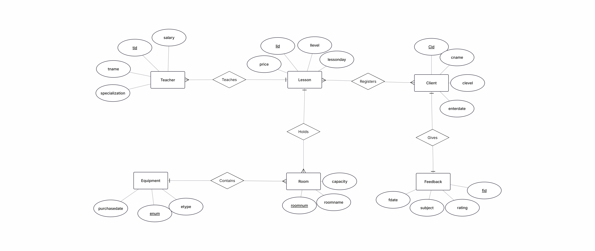

### Unified Databases
 -DSD:
  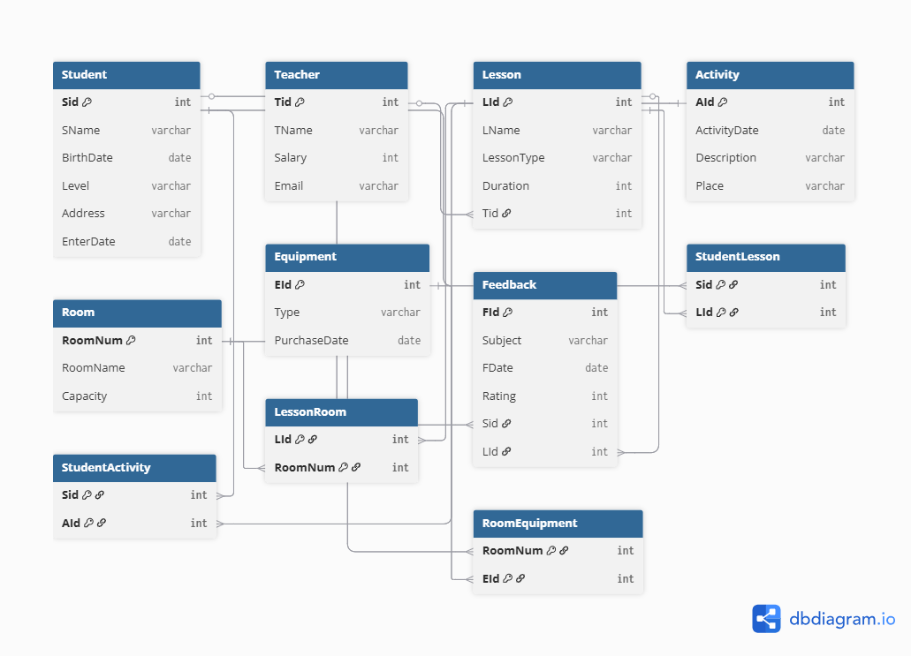
 -ERD:
  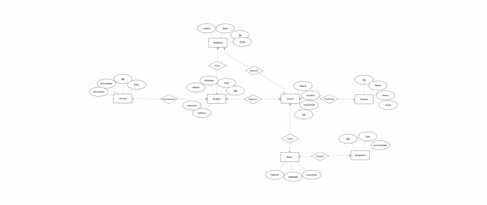

### Integration Decisions  
[📜 View integrate.sql](part3/Integrate.sql)

#### 1. Unifying Student and Client Entities 
כדי למנוע כפילות בין ישות ה-Student (מערכת המוזיקה) לישות ה-Client (מערכת הספורט), הוחלט לאחדן לישות אחת. מאחר שטבלת ה-Student כבר הכילה את רוב המידע, בחרנו להרחיב אותה.

**הוספת שדות:** הוספנו את העמודה `enterdate` שהייתה קיימת באגף הספורט לטבלת הסטודנטים כדי לשמור על נתוני ההצטרפות של הלקוחות:
```sql
ALTER TABLE Student ADD COLUMN enterdate DATE DEFAULT CURRENT_DATE;
```

#### 2. Integrating Feedback and Quality Control 
הטמענו את מערכת המשובים מהאגף החדש כדי לאפשר בקרה על איכות ההוראה במרכז המוזיקה.

קישור ישויות: טבלת ה-Feedback קושרה לטבלת ה-Student באמצעות מפתח זר (SId). החלטה זו מאפשרת לשייך כל משוב לתלמיד ספציפי ולוודא תקינות נתונים (Referential Integrity)::
```sql
 ALTER TABLE Feedback 
 ADD CONSTRAINT feedback_sid_fkey 
 FOREIGN KEY (SId) REFERENCES Student(SId););
```
#### 3. Enhancing Physical Resource Management (Room Integration) 
במערכת המקורית, שיעורים לא היו משויכים למיקום פיזי. אימצנו את ישות ה-Room מאגף הספורט כדי לנהל את חדרי הלימוד.

הרחבת טבלת Lesson: הוספנו עמודת roomnum לטבלת השיעורים כדי לשייך כל שיעור לחדר שבו הוא מתקיים:
```sql
 ALTER TABLE Lesson ADD COLUMN roomnum INT;
 ALTER TABLE Lesson 
 ADD CONSTRAINT lesson_roomnum_fkey 
 FOREIGN KEY (roomnum) REFERENCES Room(roomnum);
```

#### 4. Equipment Relocation Decision
בניתוח ה-ERD המשולב, הוחלט לשנות את הקשר של הציוד (Equipment). במקום שציוד יהיה משויך לקבוצת לימוד ערטילאית, הוא קושר פיזית לחדר (Room).

היגיון לוגיסטי: החלטה זו מאפשרת מעקב מדויק אחרי מלאי הציוד הקיים בכל חלל עבודה פיזי במרכז.

#### 5. Data Migration and Population 
כדי להבטיח שהמערכת המשולבת תהיה מבצעית מיד, בוצע תהליך הזנת נתונים (Data Seeding) תוך שמירה על קשרי גומלין:

יצירת ישויות אב: ראשית הוכנסו נתונים לטבלאות Student, Teacher ו-Room.

קישור ישויות בן: לאחר מכן עודכנו טבלאות ה-Lesson וה-Feedback תוך שימוש בשאילתות משנה (Subqueries) כדי להבטיח התאמה למפתחות הזרים הקיימים:
```sql
 UPDATE Lesson SET roomnum = (SELECT roomnum FROM Room LIMIT 1) 
 WHERE LId = (SELECT LId FROM Lesson LIMIT 1);
```
#### 6. Database Optimization via Views
כדי לפשט את הגישה לנתונים המאוחדים, יצרנו מבטים (Views) המבצעים JOIN בין הטבלאות החדשות לישנות:

LessonAssignments: מאחד את נתוני השיעור, המורה והחדר הפיזי.

StudentSatisfactionReport: מאחד את פרטי התלמיד עם נתוני המשוב ומבצע סיווג לוגי (CASE) של רמת שביעות הרצון.

#### 7. Handling Missing Data (NULL Management)
במהלך יצירת המבטים, נתקלנו במצב שבו לא לכל שיעור שובץ עדיין מורה או חדר. כדי להבטיח שכל השיעורים יופיעו בדוחות הניהוליים גם אם חסר בהם מידע, בחרנו להשתמש ב-LEFT JOIN.

החלטה טכנית: שימוש ב-JOIN רגיל היה "מעלים" שיעורים ללא חדר. ה-LEFT JOIN מאפשר להציג את השיעור עם ערך NULL בעמודת החדר/מורה, מה שמהווה אינדיקציה למנהל המערכת שנדרש שיבוץ:

-- מתוך המבט LessonAssignments
```sql
 SELECT L.LName, T.TName, R.roomname
 FROM Lesson L
 LEFT JOIN Teacher T ON L.TId = T.TId
 LEFT JOIN Room R ON L.roomnum = R.roomnum;
```
החלטה זו מבטיחה שלמות נתונים (Data Integrity) ברמת התצוגה, כך ששום שיעור לא "נעלם" מהמערכת בשל חוסר בנתונים לוגיסטיים.

### מבטים (Views)
[📜 לצפייה בקובץ views.sql](part3/Views.sql)

### מבט 1: `LessonAssignments` (שיבוץ שיעורים וחדרים)

##### תיאור המבט
מבט זה מספק תמונה כוללת של מערך השיעורים במרכז המוזיקה על ידי חיבור נתוני השיעורים, המורים והמיקומים הפיזיים. המבט מציג:
- שם השיעור ורמת הקושי
- שם המורה המלמד
- שם החדר וקיבולת החדר
- היום בשבוע בו מתקיים השיעור

```sql
 SELECT * FROM MusicLesson.LessonAssignments;
 ```
  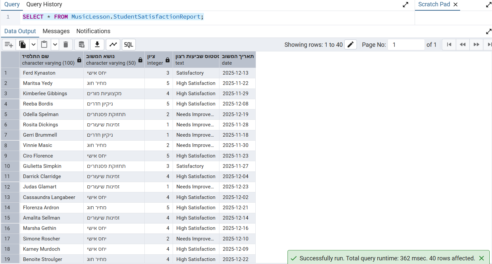

#### שאילתה 1: ניתוח תפוסת חדרים
שאילתה זו מציגה את מספר השיעורים המשובצים לכל חדר, מה שעוזר בזיהוי עומסים במרכז.
```sql
 SELECT "שם החדר", COUNT(*) AS "כמות שיעורים" 
 FROM MusicLesson.LessonAssignments 
 GROUP BY "שם החדר";
 ```
 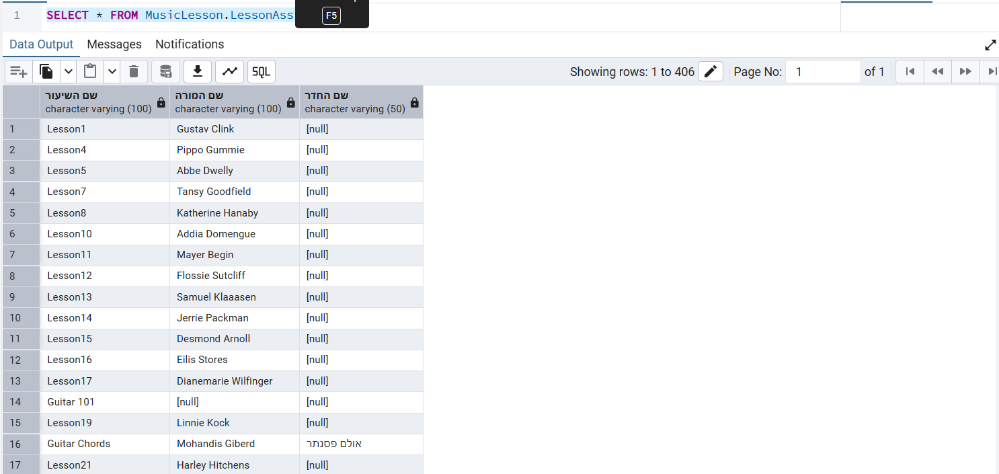


#### שאילתה 2: איתור שיעורים ברמה מתקדמת ומיקומם
רשימת כל השיעורים המוגדרים ברמת 'Advanced' ושמות המורים המשובצים אליהם.
```sql
 SELECT "שם השיעור", "שם המורה", "שם החדר" 
 FROM MusicLesson.LessonAssignments 
 WHERE "רמת השיעור" = 'Advanced';
 ```
 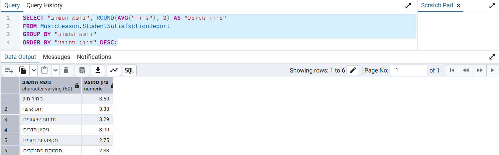


### מבט 2: StudentSatisfactionReport (דוח שביעות רצון תלמידים))

##### תיאור המבט
מבט זה משמש כלוח בקרה לאיכות השירות, המקשר בין פרטי התלמידים למשובים שהם הזינו. המבט כולל:

-שם התלמיד
-נושא המשוב והציון שניתן (1-5)
-סטטוס שביעות רצון (מחושב לוגית: "שביעות רצון גבוהה", "סביר", או "דורש שיפור")
-תאריך המשוב

```sql
 SELECT * FROM MusicLesson.StudentSatisfactionReport;
 ```
  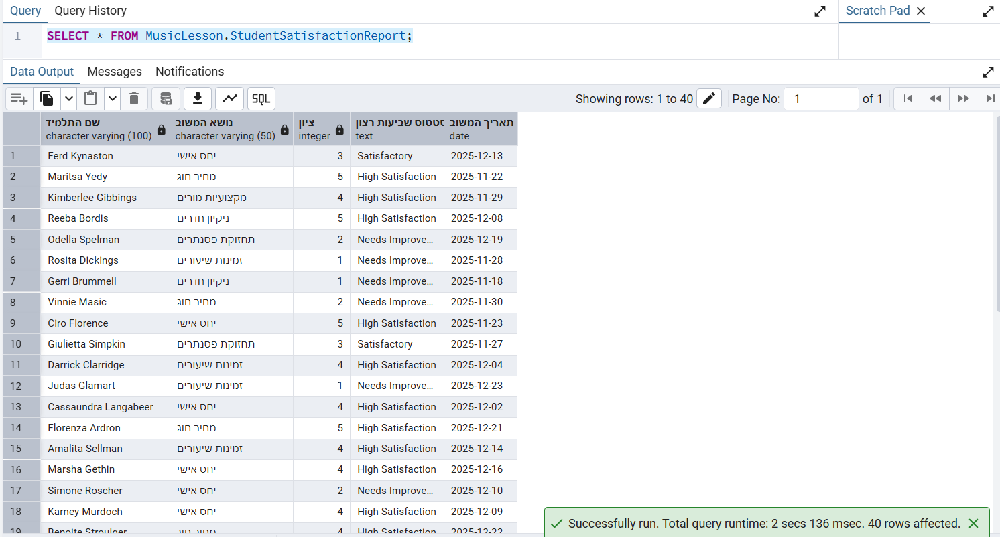


#### שאילתה 1: דוח מקרים דחופים לטיפול
 מזהה את כל המשובים שבהם הסטטוס הוא "דורש שיפור" (ציון 1-2) כדי לאפשר טיפול מהיר בתלמידים לא מרוצים.
```sql
  SELECT "שם התלמיד", "נושא המשוב", "ציון"
 FROM MusicLesson.StudentSatisfactionReport
 WHERE "סטטוס שביעות רצון" = 'Needs Improvement';
 ```
 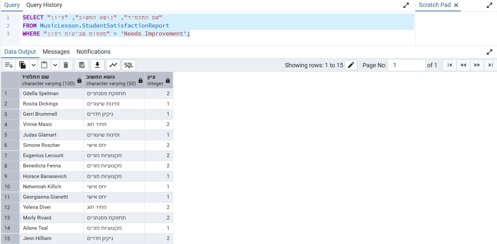

 
#### שאילתה 2: ממוצע ציונים לפי נושא 
מחשב את הציון הממוצע עבור כל תחום (מקצועיות, תחזוקה, יחס אישי) כדי להבין איפה המרכז מצטיין ואיפה עליו להשתפר.
```sql
 SELECT "נושא המשוב", ROUND(AVG("ציון"), 2) AS "ציון ממוצע"
 FROM MusicLesson.StudentSatisfactionReport
 GROUP BY "נושא המשוב"
 ORDER BY "ציון ממוצע" DESC;
 ```
 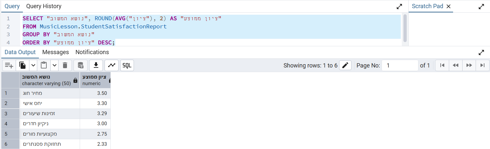

 
## Backup
- **[backup part 3](part3/backup_3.backup)** - backup file for part 3.

## Phase 4: Programming (PL/pgSQL)
בשלב זה הוטמעה לוגיקה עסקית מתקדמת בבסיס הנתונים באמצעות פרוצדורות, פונקציות וטריגרים. המטרה היא להפוך את המערכת לאוטומטית, מאובטחת וחסינה לשגיאות.
📜 לצפייה בקובצי התכנות
fn_CheckDiscount.sql – פונקציית הנחות.

pr_SafeRegister.sql – פרוצדורת רישום מאובטח.

trg_RoomCapacity.sql – טריגר הגבלת תפוסה.

Main_Script.sql – תוכנית הרצה ובדיקה.

